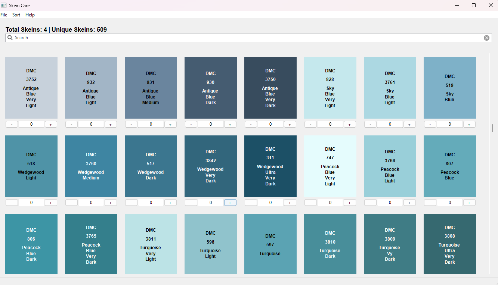

# Skein Care

A native desktop application designed to help catalog thread skeins for embroidery, cross-stitch, and other fiber arts.

## Features

- Track your thread inventory with adjustable counters
- Sort collection by Brand, SKU, Name, or Count
- Search skeins by SKU or name
- Pick colors directly from your screen

## Installation

### Windows .exe
- Extract the ZIP file to a location of your choice.
- Run `Skeincare.exe` to start the application.

**Note:** Since the application is not signed with a certificate, Windows may display a security warning. To run the application:
- Click "More info" on the warning dialog. 
- Click "Run anyway" to proceed.

### Mac .app
- Extract the ZIP file to a location of your choice.
- Move `Skeincare.app` to your Applications folder.
- Right-click on `Skeincare.app` and select "Open" to bypass macOS security restrictions.

**Note:** Since the application is not signed with an Apple Developer certificate, macOS may display a security warning. The first time you run the application, you'll need to right-click and select "Open" instead of double-clicking.

### Linux binary
- Extract the archive to a location of your choice.
- Make the binary executable: `chmod +x Skeincare`
- Run the application: `./Skeincare`

### From Source
To run the application from source:
- Clone the repository:
  - `git clone https://github.com/jaylinwylie/skein-care.git`
  - `cd skein-care` 
- Create virtual environment: `python -m venv .venv`
- Activate virtual environment
  - For Windows: `.\.venv\Scripts\activate`
  - For MacOS/Linux: `source .venv/bin/activate`
- Install the required dependencies: `pip install -r requirements.txt`
- Run the application: `python main.py`

### Building
To build the application for your platform:
- Install the builder:
  - `pip install pyinstaller`
- Build
  - For Windows: `pyinstaller spec/win.spec`
  - For MacOS: `pyinstaller spec/mac.spec`
  - For Linux: `pyinstaller spec/linux.spec`

The binary will be created in the `dist` directory.
